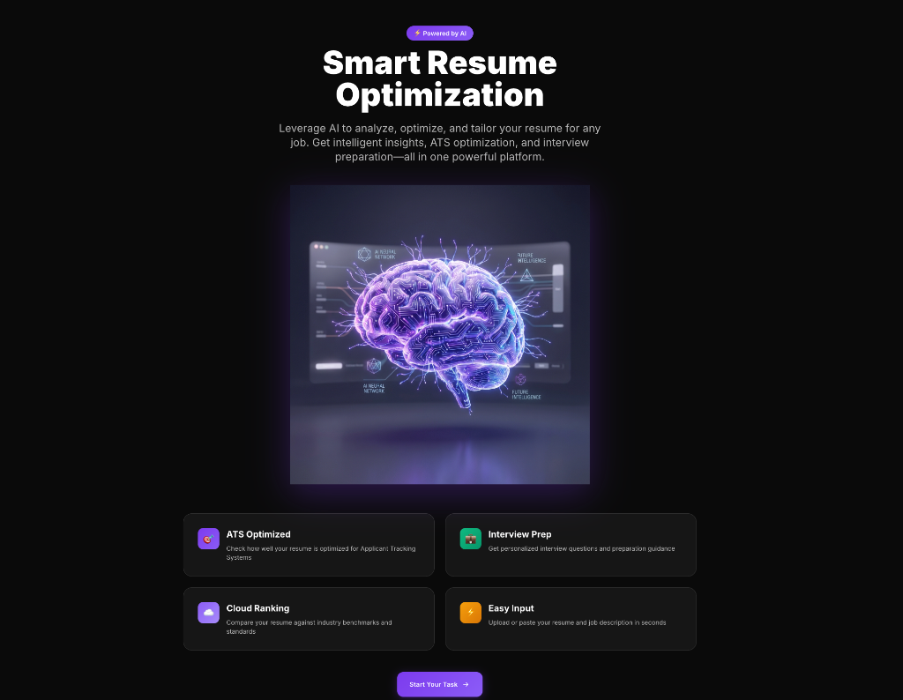
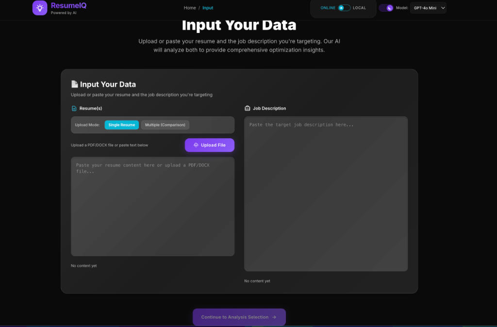
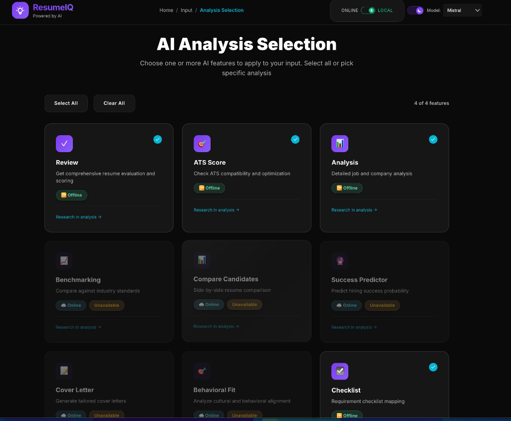
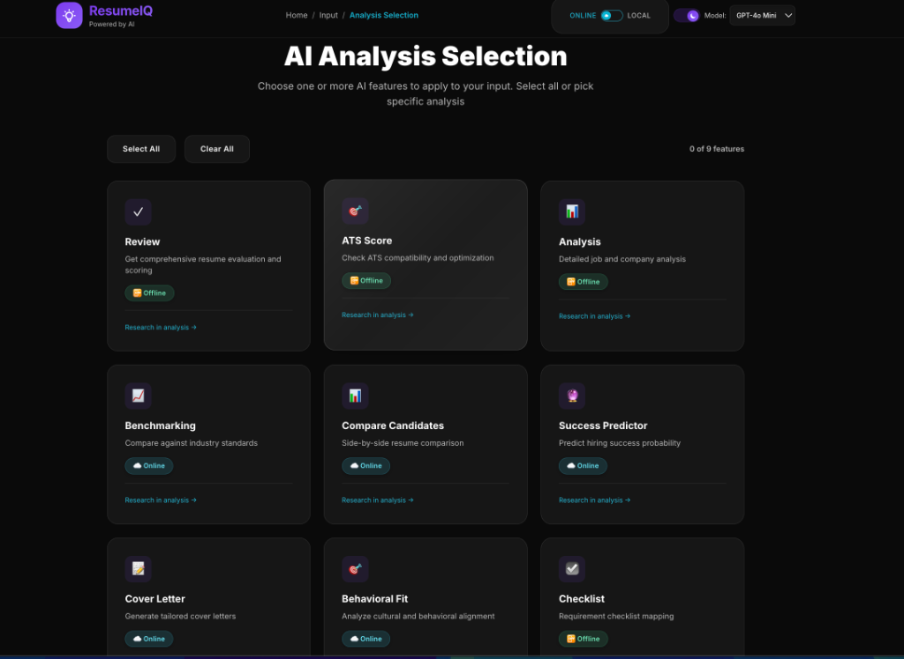
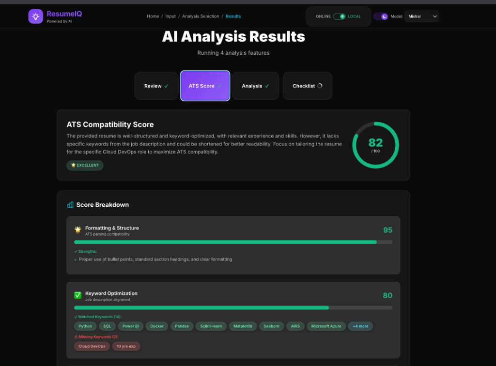

# Resume IQ - AI-Powered Resume Analysis Platform

<div align="center">


**Transform your hiring process with AI-powered resume analysis, candidate comparison, and predictive analytics.**

[Features](#-features) • [Setup](#-installation--setup) • [Usage](#-usage) • [Modes](#-operating-modes) • [Tech Stack](#-tech-stack)

</div>

---

## 🚀 Features

### Core Analysis Tools

#### 📝 **Resume Review** 📴
- Comprehensive ATS compatibility analysis
- Skill extraction and matching
- Experience evaluation
- Improvement recommendations
- **Works offline with local models**

#### 📊 **Job Description Analysis** 📴
- Role requirements breakdown
- Skills categorization (required vs. preferred)
- Seniority level assessment
- Market insights
- **Works offline with local models**

#### 🎯 **Behavioral Fit Analysis** ☁️
- Cultural alignment assessment
- Soft skills evaluation
- Team compatibility insights
- Leadership potential analysis
- **Requires online mode for best results**

#### 🔍 **Hidden Requirements Detection** ☁️
- Uncover implicit job requirements
- Read between the lines
- Identify unstated expectations
- Cultural fit indicators
- **Requires online mode for advanced reasoning**

#### ☑️ **Requirements Checklist** 📴
- Detailed requirement mapping
- Match percentage calculation
- Gap identification
- Priority-based recommendations
- **Works offline with local models**

### Advanced Features

#### 📊 **Candidate Comparison Dashboard**
- **Compare up to 5 candidates** side-by-side
- Visual skill match charts (required vs. preferred)
- Automatic ranking by overall score
- Detailed breakdown per candidate
- Export comparison results

#### 🔮 **Success Predictor**
- **Dual-analysis system**: JD Fit (60%) + Cultural Fit (40%)
- Index top performer profiles
- 6-dimensional trait analysis:
  - Leadership
  - Technical Depth
  - Communication
  - Adaptability
  - Impact
  - Team Collaboration
- Radar chart visualization
- Similar performer matching
- Predictive success scoring

#### 📝 **Cover Letter Generator**
- **AI-powered personalization**
- 3 tone options: Professional, Enthusiastic, Creative
- 3 length options: Short (200-250), Medium (300-400), Long (450-550 words)
- PDF export
- Copy to clipboard
- Key highlights extraction
- Improvement suggestions

#### 📈 **Industry Benchmarking**
- **12 tech roles** with comprehensive data
- Salary estimates by experience level (Junior/Mid/Senior)
- Market competitiveness scoring (0-100)
- Skills gap analysis
- Career insights & recommendations
- Growth potential assessment
- Visual salary charts

---

## 🎨 Screenshots & User Interface

Experience Resume IQ's modern, intuitive interface designed for maximum productivity and visual appeal.

### 1. Landing Page - First Impressions Matter



**Smart Resume Optimization Hub**

The landing page welcomes users with a stunning visual featuring an AI brain graphic, immediately communicating the platform's AI-powered capabilities. Key highlights include:

- **Clear Value Proposition**: "Leverage AI to analyze, optimize, and tailor your resume for any job"
- **Feature Cards**: Quick overview of core capabilities
  - 🎯 **ATS Optimized**: Check resume compatibility with Applicant Tracking Systems
  - ☁️ **Cloud Ranking**: Compare against industry benchmarks
  - 💬 **Interview Prep**: Get personalized interview preparation guidance
  - 📝 **Easy Input**: Simple upload or paste interface
- **Premium Design**: Dark theme with purple/blue gradients and glassmorphism effects
- **Call-to-Action**: Prominent "Start Your Test" button to begin the journey

### 2. Data Input Page - Seamless Upload Experience



**Flexible Input Options for Maximum Convenience**

The input page provides a clean, organized interface for uploading your data:

- **Dual-Panel Layout**: 
  - **Left Panel (Resume)**: Upload PDF/DOCX files or paste text directly
  - **Right Panel (Job Description)**: Paste the target job posting
- **Upload Mode Toggle**: Switch between "Single Resume" and "Multiple (Comparison)" modes
- **File Upload Button**: Prominent purple button for easy file selection
- **Real-time Validation**: Shows "No content yet" status before data is added
- **Navigation Breadcrumb**: Clear path showing Home → Input
- **Mode Indicators**: Top-right shows ONLINE/LOCAL toggle and selected AI model (GPT-4o Mini)
- **Continue Button**: Disabled until both resume and job description are provided

### 3. Analysis Selection (Local Mode) - Feature Discovery



**Choose Your Analysis Tools with Clear Availability Indicators**

When in **LOCAL mode** (using Ollama), the interface intelligently shows which features are available offline:

- **Feature Grid**: 9 analysis options displayed as cards with icons
- **Offline-Ready Features** (marked with 📴 Offline badge):
  - ✓ **Review**: Comprehensive resume evaluation and scoring
  - 📊 **ATS Score**: Check ATS compatibility and optimization
  - 📈 **Analysis**: Detailed job and company analysis
  - ☑️ **Checklist**: Requirement checklist mapping
- **Online-Only Features** (marked as "Unavailable"):
  - 🏆 **Benchmarking**: Compare against industry standards
  - 👥 **Compare Candidates**: Side-by-side resume comparison
  - 🔮 **Success Predictor**: Predict hiring success probability
  - 📝 **Cover Letter**: Generate tailored cover letters
  - 🎯 **Behavioral Fit**: Analyze cultural and behavioral alignment
- **Selection Counter**: Shows "4 of 4 features" selected
- **Bulk Actions**: "Select All" and "Clear All" buttons
- **Research Links**: Each card has a "Research in analysis →" link for more details

### 4. Analysis Selection (Online Mode) - Full Feature Access



**Unlock All Features with Online Mode**

When switched to **ONLINE mode** (using GPT-4o Mini), all features become available:

- **All Features Enabled**: No "Unavailable" badges - every analysis tool is accessible
- **Mode Toggle**: Top-right shows ONLINE is active (green indicator)
- **Model Selection**: Dropdown showing "GPT-4o Mini" as the selected model
- **Same Clean Interface**: Consistent design whether online or offline
- **Feature Badges**: 
  - 📴 **Offline** badge for features that work in both modes
  - ☁️ **Online** badge for cloud-only features
- **Smart Selection**: Users can select any combination of features
- **Seamless Switching**: Toggle between modes without losing your progress

### 5. Analysis Results - ATS Score Breakdown



**Comprehensive ATS Compatibility Analysis with Visual Feedback**

The results page showcases Resume IQ's powerful analysis capabilities:

- **Tab Navigation**: Switch between different analysis results (Review, ATS Score, Analysis, Checklist)
- **Overall Score**: Large circular gauge showing **82/100** with "EXCELLENT" rating
- **Detailed Breakdown**:
  - 📋 **Formatting & Structure** (95/100): 
    - ✅ Strengths: Proper bullet points, standard section headings, clear formatting
  - ✓ **Keyword Optimization** (80/100):
    - ✅ **Matched Keywords** (14): Python, SQL, PowerBI, Docker, Pandas, Scikit-learn, Matplotlib, Seaborn, AWS, Microsoft Azure, and more
    - ⚠️ **Missing Keywords** (4): Cloud DevOps, 10 yrs exp (highlighted in red)
- **Visual Progress Bars**: Color-coded bars (green for good, red for issues)
- **Actionable Insights**: Clear identification of what's working and what needs improvement
- **Professional Design**: Dark theme with cyan/green accent colors for positive metrics
- **Badge System**: Visual indicators for different score levels

---

## 📦 Installation & Setup

### Prerequisites
- **Node.js 18+** and npm/yarn
- **For Online Mode**: OpenAI API key
- **For Offline Mode**: Ollama installed locally (optional)

### Quick Start (Online Mode)

1. **Clone the repository**
```bash
git clone https://github.com/Vishal42001/Resume_IQ.git
cd Resume_IQ
```

2. **Install dependencies**
```bash
npm install
```

3. **Run the application**
```bash
npm run dev
```

4. **Configure API Key**
   - Open [http://localhost:5173](http://localhost:5173)
   - Click the settings icon in the navbar
   - Enter your OpenAI API key
   - Key is stored securely in browser localStorage

### Offline Setup (Privacy Mode)

For complete offline operation with local AI models:

📄 **[See Complete Offline Setup Guide →](OFFLINE_SETUP.md)**

**Quick Summary:**
```bash
# Install Ollama
brew install ollama  # macOS
# or
curl https://ollama.ai/install.sh | sh  # Linux

# Start Ollama
ollama serve

# Download a model
ollama pull llama2

# Run the app
npm run dev

# Toggle to "Local" mode in the UI
```

### Hybrid Setup (Best of Both Worlds)

Use local models for simple tasks and OpenAI for complex analysis:

📄 **[See Hybrid Setup Guide →](HYBRID_SETUP.md)**

---

## 🌐 Operating Modes

Resume IQ supports **three operating modes** to fit your needs:

### ☁️ Online Mode (Default)
- Uses OpenAI GPT-4o/GPT-4o-mini
- **Best quality** for all features
- Requires internet connection
- API costs apply
- All features available

### 📴 Offline Mode (Privacy First)
- Uses local Ollama models (Llama 2, Mistral, etc.)
- **Complete privacy** - data never leaves your device
- No internet required
- No API costs
- Unlimited usage
- Limited to basic features (Review, Analysis, Checklist)

### 🔄 Hybrid Mode
- Automatically routes tasks to best model
- Simple tasks → Local model (fast, free)
- Complex tasks → OpenAI (high quality)
- Automatic fallback if one fails
- Optimal cost/quality balance

**Feature Availability by Mode:**

📄 **[See Feature Availability Matrix →](FEATURE_AVAILABILITY.md)**

| Feature | Offline 📴 | Online ☁️ |
|---------|-----------|----------|
| Resume Review | ✅ | ✅ |
| Job Analysis | ✅ | ✅ |
| Requirements Checklist | ✅ | ✅ |
| Behavioral Fit | ❌ | ✅ |
| Hidden Requirements | ❌ | ✅ |
| Resume Rewrite | ❌ | ✅ |
| Cover Letter Generator | ⚠️ Basic | ✅ Advanced |
| Success Predictor | ⚠️ Basic | ✅ Advanced |
| Candidate Comparison | ✅ | ✅ |
| Industry Benchmarking | ✅ | ✅ |

### Switching Modes

Toggle between modes using the **Local/Online switch** in the navbar:
- Features automatically enable/disable based on current mode
- Grayed-out features indicate unavailability in current mode
- Mode preference is saved in localStorage

---

## 🎮 Usage

### Basic Workflow

1. **Choose Your Mode**
   - Toggle Local/Online in the navbar
   - Select AI model (GPT-4o, GPT-4o-mini, or local model)

2. **Upload Resume**
   - Paste text directly OR
   - Upload PDF/DOCX file
   - Supports multiple resumes for comparison

3. **Add Job Description**
   - Paste the job posting
   - Include company info for better results

4. **Select Analysis Type**
   - Choose from 8+ analysis tools
   - Each provides unique insights
   - Check feature availability badges

5. **Review Results**
   - Interactive visualizations
   - Actionable recommendations
   - Export options (PDF, CSV)

### Advanced Features

#### Candidate Comparison
1. Switch to "Multiple (Comparison)" mode
2. Upload 2-5 resumes
3. Add job description
4. Go to "Compare Candidates" tab
5. View ranked results with charts

#### Success Predictor
1. Upload 3-20 top performer profiles
2. Upload candidate resume
3. Add job description
4. Run prediction analysis
5. Review dual-score breakdown

#### Cover Letter Generator
1. Upload resume and job description
2. Go to "Cover Letter" tab
3. Select tone and length
4. Generate personalized letter
5. Download PDF or copy text

#### Industry Benchmarking
1. Upload resume and job description
2. Go to "Benchmarking" tab
3. View salary estimates
4. Analyze skills gaps
5. Review career recommendations

---

## 🛠️ Tech Stack

### Frontend
- **React 19.2.0** - UI framework
- **Vite 7.2.4** - Build tool & dev server
- **Tailwind CSS 3.4** - Utility-first styling
- **Recharts 3.5** - Data visualization

### AI & Processing
- **OpenAI API** - GPT-4o, GPT-4o-mini (online mode)
- **Ollama** - Local LLM support (offline mode)
- **Custom prompts** - Specialized analysis logic

### File Processing
- **mammoth 1.11** - DOCX parsing
- **pdfjs-dist 5.4** - PDF extraction
- **jsPDF 3.0** - PDF generation
- **papaparse 5.5** - CSV export
- **docx 9.5** - Document generation
- **file-saver 2.0** - File downloads

### State Management
- React Hooks (useState, useEffect, useCallback)
- localStorage for persistence
- Context API for global state

---

## 📊 Supported Roles (Benchmarking)

The Industry Benchmarking feature includes data for:

- Software Engineer
- Frontend Developer
- Backend Developer
- Full Stack Developer
- Data Scientist
- DevOps Engineer
- Product Manager
- UX/UI Designer
- Machine Learning Engineer
- Cloud Architect
- Mobile Developer (iOS/Android)
- Security Engineer

Each role includes:
- Salary ranges by experience level
- Required vs. preferred skills
- Market demand indicators
- Growth potential metrics

---

## 🎨 Design Features

- **Modern glass morphism UI** with backdrop blur effects
- **Vibrant cyan/blue gradient theme** (#06b6d4, #0ea5e9)
- **Dark mode optimized** with proper contrast
- **Fully responsive** - works on mobile, tablet, desktop
- **Smooth animations** and micro-interactions
- **Accessible** with ARIA labels and keyboard navigation
- **Premium aesthetics** with custom gradients and shadows

---

## 🔒 Privacy & Security

### Data Privacy
- ✅ **Local-first architecture** - All processing in browser
- ✅ **No server storage** - Resume data never uploaded
- ✅ **Offline mode available** - Complete privacy with local models
- ✅ **No tracking** - Zero analytics or telemetry

### API Security
- ✅ **Client-side only** - API keys stored in browser localStorage
- ✅ **Never transmitted** - Keys only used for direct API calls
- ✅ **User-controlled** - Easy to update or remove keys

### Best Practices
- Use offline mode for sensitive resumes
- Regularly clear browser data if on shared computers
- Consider using local Ollama for maximum privacy

---

## 🚦 Roadmap

### Completed ✅
- [x] Resume review and analysis
- [x] Job description analysis
- [x] Behavioral fit assessment
- [x] Hidden requirements detection
- [x] Requirements checklist
- [x] Candidate comparison dashboard (up to 5 candidates)
- [x] Success predictor with top performers indexing
- [x] Cover letter generator (3 tones, 3 lengths)
- [x] Industry benchmarking (12 tech roles)
- [x] Offline mode with Ollama integration
- [x] Hybrid mode with intelligent routing
- [x] PDF/DOCX upload support
- [x] Export to PDF/CSV

### In Progress 🚧
- [ ] Batch processing (10+ candidates)
- [ ] Historical tracking and analytics
- [ ] Advanced export reports (Excel, detailed PDF)

### Planned 📋
- [ ] Chrome extension for LinkedIn integration
- [ ] Team collaboration features
- [ ] Interview question generator
- [ ] Salary negotiation assistant
- [ ] ATS integration (Greenhouse, Lever, Workday)
- [ ] Multi-language support
- [ ] Resume templates library
- [ ] Video interview analysis

---

## 🤝 Contributing

Contributions are welcome! Please follow these steps:

1. Fork the repository
2. Create a feature branch (`git checkout -b feature/AmazingFeature`)
3. Commit your changes (`git commit -m 'Add some AmazingFeature'`)
4. Push to the branch (`git push origin feature/AmazingFeature`)
5. Open a Pull Request

### Development Guidelines
- Follow existing code style
- Add comments for complex logic
- Update documentation for new features
- Test both online and offline modes
- Ensure responsive design

---

## 📝 License

This project is licensed under the MIT License - see the [LICENSE](LICENSE) file for details.

---

## 👨‍💻 Author

**Vishal Kumar Singh**

- GitHub: [@Vishal42001](https://github.com/Vishal42001)
- LinkedIn: [Your LinkedIn](https://linkedin.com/in/yourprofile)

---

## 🙏 Acknowledgments

- **OpenAI** for GPT-4 API and excellent documentation
- **Ollama** for making local LLMs accessible
- **Recharts** for beautiful and responsive charts
- **Tailwind CSS** for utility-first styling
- **Vite** for blazing-fast development experience
- **React team** for the amazing framework

---

## 📧 Support

- **Issues**: [GitHub Issues](https://github.com/Vishal42001/Resume_IQ/issues)
- **Discussions**: [GitHub Discussions](https://github.com/Vishal42001/Resume_IQ/discussions)
- **Email**: your-email@example.com

---

## 🔗 Additional Resources

- 📄 [Offline Setup Guide](OFFLINE_SETUP.md) - Complete guide for local AI setup
- 📄 [Hybrid Setup Guide](HYBRID_SETUP.md) - Configure mixed online/offline mode
- 📄 [Feature Availability](FEATURE_AVAILABILITY.md) - Feature matrix by mode

---

<div align="center">

**⭐ Star this repo if you find it helpful!**

Made with ❤️ by Vishal Kumar Singh

</div>
